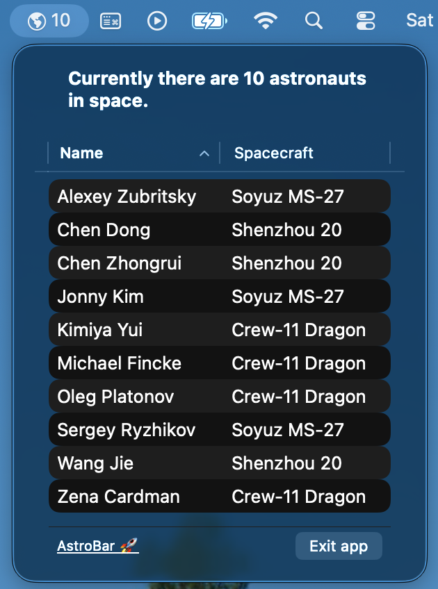

# AstroBar 🚀

Ever wondered how many humans are currently floating around in space? Neither did I until I made this app!

## Overview

AstroBar is a tiny macOS menu bar app that answers the most important question of your day: "Who's in space right now?"

Because let's face it, while you're sitting here debugging code, there are people literally orbiting the planet at 28,000 km/h. This app helps you keep track of them, so you can feel jealous in real-time.

The app shows you:
- How many astronauts are currently having the time of their lives in microgravity
- Their names (so you can Google them and feel inadequate)
- Which spacecraft they're hanging out in
- All this cosmic knowledge refreshes every 12 hours, because space stuff doesn't change that fast

## What You Get

- A cute little icon in your menu bar with a number (that's the astronaut count, not your unread emails)
- Click it and boom: a dropdown showing:
  - Who's up there right now
  - What tin can they're riding in
  - A loading spinner (because even space data takes time)

## Requirements

- Internet connection (ironic that you need internet to know who's above the internet)
- A healthy sense of wonder about space ✨

## Tech Stack (Overkill Edition)

Yes, this is a tiny menu bar app. Yes, I used Clean Architecture. Don't judge me.

## Where The Magic Comes From

All astronaut data graciously provided by [international-space-station-API](https://github.com/corquaid/international-space-station-APIs).

Shoutout to whoever maintains this API. You're the real MVP.
